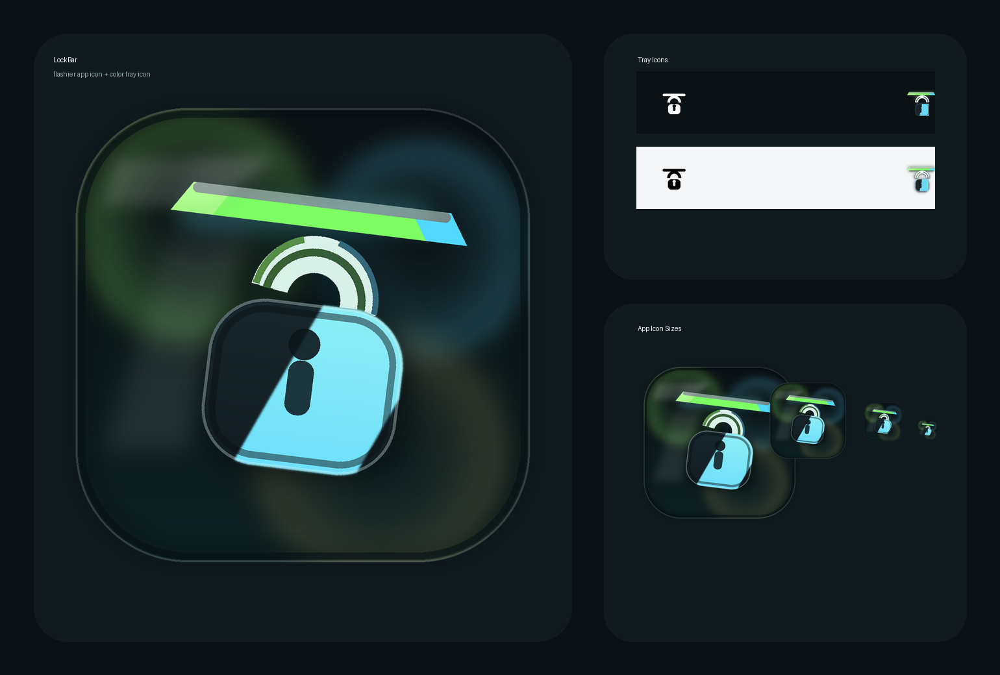

# LockBar



[简体中文](#简体中文) | [English](#english)

## 简体中文

LockBar 是一个常驻在 macOS 菜单栏里的轻量锁屏工具，目标很直接: 用一次点击，立刻锁屏。

如果你经常临时离开工位，最快的路径应该是点击菜单栏图标，而不是切回桌面、记快捷键，或者打开一个完整应用再操作。

[下载最新版](https://github.com/gofenix/lockbar/releases/latest)

### 为什么是 LockBar

- 常驻菜单栏，不占 Dock
- 左键立即锁屏
- 右键打开轻量控制菜单
- 可设置登录时自动启动
- 支持简体中文和 English

### 它是怎么工作的

LockBar 本质上是代你触发 macOS 标准锁屏快捷键 `Control + Command + Q`。

它会请求一次“辅助功能”权限，因为 macOS 规定，应用要发送系统级键盘事件时必须拥有这个权限。LockBar 没有自定义锁屏机制，也不会绕过系统锁屏流程。

### 首次使用

1. 从 Releases 页面下载最新 DMG。
2. 将 `LockBar.app` 拖入 `Applications`。
3. 启动 LockBar。
4. 第一次使用时，在 `系统设置 > 隐私与安全性 > 辅助功能` 中为 LockBar 开启权限。
5. 返回后再次点击菜单栏图标，即可执行锁屏。

如果你刚授权但 macOS 没有立刻刷新状态，退出并重新打开 LockBar 一次即可。

### 产品特性

#### 以速度为第一原则

LockBar 的核心不是“功能很多”，而是“最快完成锁屏这一个动作”。

#### 尽量少打扰

它不强调主窗口，不做复杂设置页，主要交互都围绕菜单栏完成。

#### 遵循原生 macOS 习惯

LockBar 触发的是系统原生锁屏快捷键，所以行为更稳定，也更符合用户预期。

### 系统要求

- macOS 13 及以上
- 已为 LockBar 开启辅助功能权限

### 开发与发布

本地运行:

```bash
flutter pub get
flutter run -d macos
```

打包签名并生成可分发 DMG:

```bash
xcrun notarytool store-credentials lockbar-notary \
  --apple-id <YOUR_APPLE_ID> \
  --team-id 993F5N3HV6 \
  --password <APP_SPECIFIC_PASSWORD>

./scripts/release-macos.sh
```

如需指定版本号:

```bash
./scripts/release-macos.sh --build-name 1.0.3 --build-number 4
```

## English

LockBar is a lightweight macOS menu bar app built for one job: locking your screen instantly.

If you step away from your Mac often, the fastest path should be a click in the menu bar, not switching context, remembering shortcuts, or opening a full app first.

[Download the latest release](https://github.com/gofenix/lockbar/releases/latest)

### Why LockBar

- Lives in the menu bar instead of the Dock
- Left-click locks your Mac immediately
- Right-click opens a lightweight control menu
- Can launch automatically at login
- Supports Simplified Chinese and English

### How it works

LockBar triggers the standard macOS lock shortcut, `Control + Command + Q`, on your behalf.

It asks for Accessibility permission once because macOS requires that permission for apps that send system keyboard events. LockBar does not invent a custom lock mechanism or bypass the system lock flow.

### First run

1. Download the latest DMG from the Releases page.
2. Drag `LockBar.app` into `Applications`.
3. Launch LockBar.
4. The first time you use it, enable LockBar in `System Settings > Privacy & Security > Accessibility`.
5. Return to the app and click the menu bar icon again to lock your Mac.

If you just granted permission and macOS has not refreshed the state yet, quit and reopen LockBar once.

### Product highlights

#### Speed first

LockBar is designed around the fastest possible outcome: click once, lock the screen, move on.

#### Minimal surface area

It stays out of the Dock, keeps configuration lightweight, and centers the experience on the menu bar instead of a full settings-heavy window.

#### Native macOS behavior

LockBar uses the built-in macOS lock shortcut, so the behavior stays predictable and familiar.

### Requirements

- macOS 13 or later
- Accessibility permission enabled for LockBar

### Development and release

Run locally:

```bash
flutter pub get
flutter run -d macos
```

Build, sign, notarize, and package a distributable DMG:

```bash
xcrun notarytool store-credentials lockbar-notary \
  --apple-id <YOUR_APPLE_ID> \
  --team-id 993F5N3HV6 \
  --password <APP_SPECIFIC_PASSWORD>

./scripts/release-macos.sh
```

Override the release version when needed:

```bash
./scripts/release-macos.sh --build-name 1.0.3 --build-number 4
```
